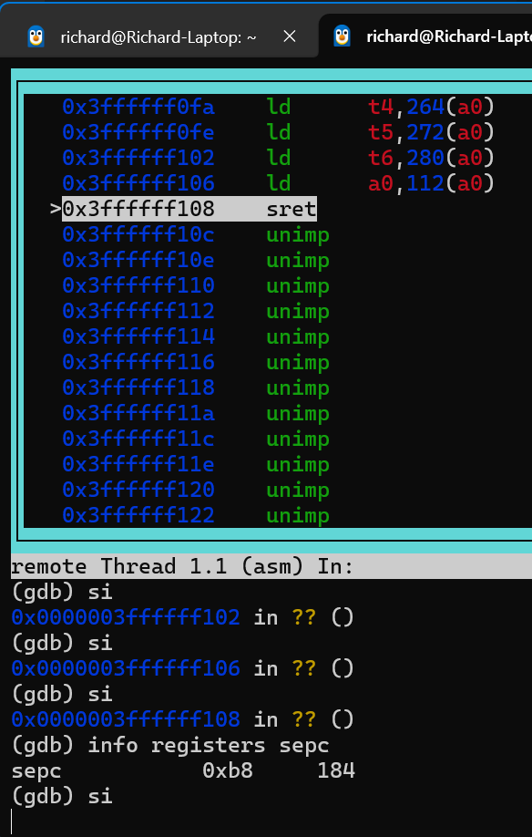

# Debug

发现user_init加载之后无法正常跳转到shell

检查fork

添加调试信息
```cxx
printf("fork start\n");
int pid = fork();
printf("fork suceess, pid=%i\n", pid);
```
正常打印，fork()没有问题

尝试在 'exec(sh_path, argv);' 前后添加调试信息

该代码之前有输出，之后无输出

尝试解决exec.cc的问题

在exec()函数开头处添加调试信息

```CXX
        Drivers::uart_puts("Enter Exec\n");
        // Get Inode
        Inode *raw_ip = VFS::namei(path);
        if (!raw_ip)
            return -1;
        InodeGuard iguard(raw_ip);
```

没有输出

怀疑是系统注册的问题，但不可能，因为在实现shell之前的简易测试程序证明系统调用没有问题

尝试 GDB 调试



发现卡在 sret 返回的部分，跳转的地址没有问题，但是卡死，说明CPU没有跑飞，可能遇到了死循环

检查sys_exec()

通过在每行代码前后添加打印调试信息，发现问题出在这行代码：
```cxx
        kargv.args[i] = (char *)Slab::kmalloc(KernelArgv::MAX_ARG_LEN);
```
这行代码之后的打印信息没有输出，说明这里一直在执行！

检查Slab

像之前一样通过在每行代码前后添加打印调试信息，发现问题出在这里：
```cxx
for (uint i = 0; i < c->obj_count_per_slab - 1; i++)
        {
            // The content of the i-th object is i+1
            uint16 *ptr = (uint16 *)(base + i * c->obj_size);
            *ptr = i + 1;
        }
```
这段代码之前的信息可以输出，之后的不能输出，说明这里出问题了

在循环内部打印信息，发现调试信息刷屏

证明了在GDB里面看到的消息，并不是CPU跑到了某些神秘地址，而是一直卡在这个死循环！

这里出现了死循环，说明这里循环终止条件出了问题，根本原因需要排查

可能是错误的计算，导致这里成了ull的最大值，即使在 3 GHz CPU 上跑空循环，跑满 unsigned long long 最大值次数也需要 近千年。

怀疑之前这个值是0

添加代码：
```cxx
    if (c->obj_count_per_slab == 0)
        Drivers::uart_puts("it is 0");
```
证明猜测正确

这里检查发现这个值确实是0，但它为什么能是0呢？

可能是初始化的问题？？？？

检查系统初始化main.cc

发现Slab确实没有初始化，导致c->obj_count_per_slab这个值一直是0！

初始化！

正常加载shell

说明 ELF 加载，只读 FAT32 文件系统 正常实现

该bug解决